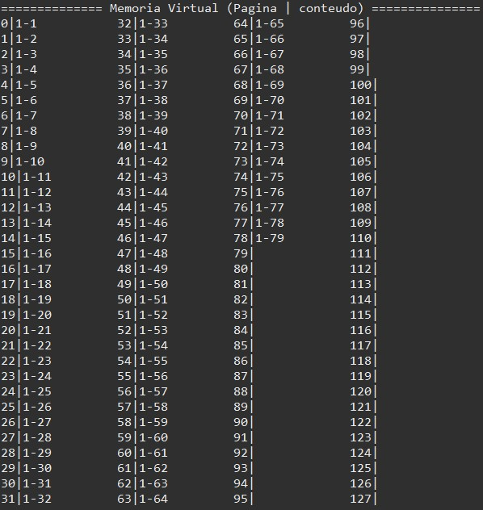
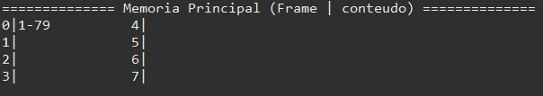
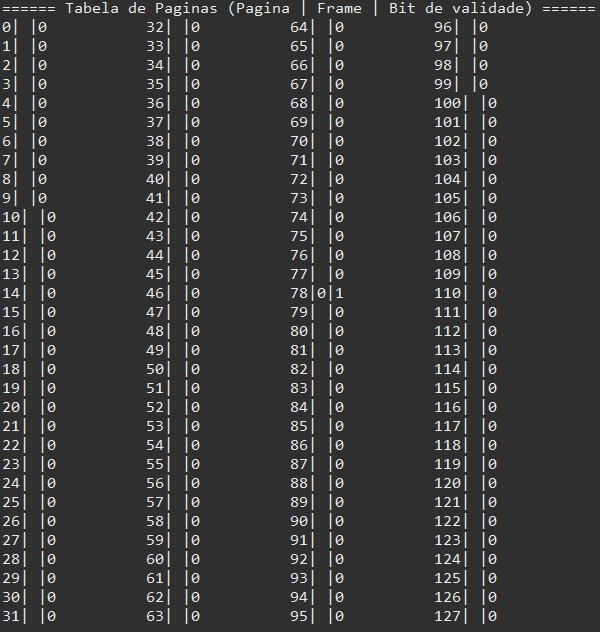
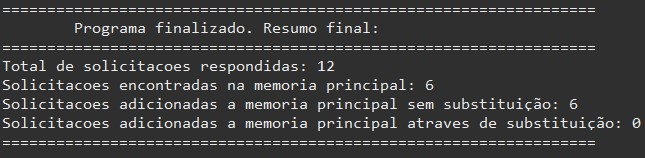

## Trabalho Prático - Gerenciamento de Memória
 
O Trabalho Prático - Gerenciamento de Memória, consiste no segundo trabalho da disciplina de Laboratório de Sistemas Operacionais. Nele, foi criado um simulador de página virtual.
Haverá três estruturas principais para simular o gerenciamento de memória: uma memória principal de 64KB, uma memória virtual de 1MB (1024KB) e uma MMU para gerenciar a tabela de páginas. Além disso, durante a execução do código é criado uma thread responsável por solicitar acesso a suas páginas ao passar um período de tempo aleatório.

 <a href="#tecnologias">Tecnologias</a> •
 <a href="#serviços-usados">Serviços usados</a> • 
 <a href="#features">Features</a> • 
 <a href="#autora">Autora</a>

 
## Tecnologias 
  
* Java SE 15
 
## Serviços usados
 
* Github
* Eclipse IDE version 4.24.0

## Features
 
* Solicitação de acesso a suas páginas pelo processo (thread)
* Adição de páginas do processo à memória virtual
* Adição de páginas do processo à memória principal
* Mapeamento das páginas em memória virtual nos frames da memória principal por meio da tabela de páginas
* Substituição de frames na memória principal por meio do algoritmo FIFO (first in - first out)
* Visualização das mudanças realizadas nas memórias da seguinte forma:
  * Memória Virtual: "x|y", sendo x o número da página na memória virtual e y a identificação da página do processo
  
  
  * Memória Principal: "(x|y), sendo x o frame na memória principal e y a identificação da página do processo
   
 
  * Tabela de Páginas: "x|y|z", sendo x a página da memória virtual, y o frame na memória principal e z o bit de validade (0 = não se encontra na memória principal, 1 = se encontra)
     

* Visualização da estatística final do simulador, incluindo:
  * Total de solicitações respondidas
  * Quantidade de solicitações encontradas na memoria principal
  * Quantidade de solicitações adicionadas na memoria principal sem substituição
  * Quantidade de solicitações adicionadas na memoria principal através de substituição

                                                                  
Exemplo da visualização da estatística final.  
 
## Autora
 
* **Gabrielle Bussolo**: @gabriellebussolo (https://github.com/gabriellebussolo)
